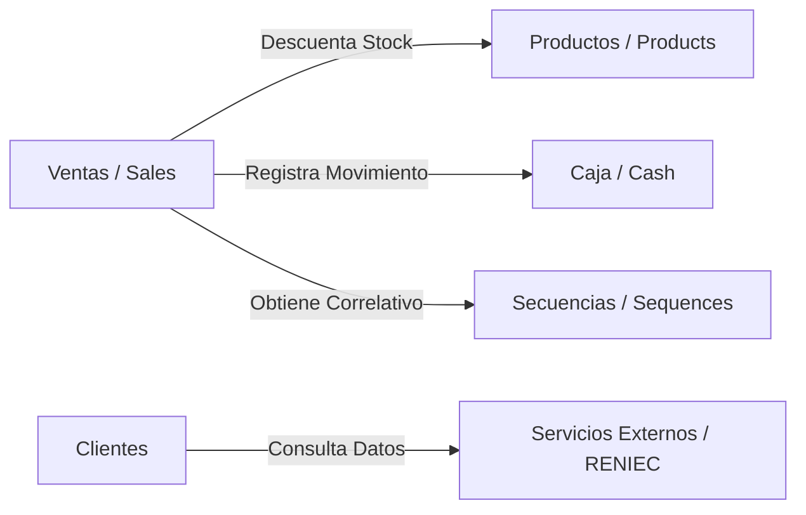

# Plan de Pruebas de Sistema, Aceptación e Integración — RegistraMe (Sprint 3-4)

---

## Índice

1. [Introducción y Alcance](#1-introducción-y-alcance)
2. [Estrategia de Pruebas de Integración](#2-estrategia-de-pruebas-de-integración)
   - 2.1. [Componentes y Flujos de Integración](#21-componentes-y-flujos-de-integración)
   - 2.2. [Casos de Prueba de Integración](#22-casos-de-prueba-de-integración)
3. [Estrategia de Pruebas de Sistema y Aceptación (UAT)](#3-estrategia-de-pruebas-de-sistema-y-aceptación-uat)
   - 3.1. [Casos de Prueba de Sistema (E2E con Playwright)](#31-casos-de-prueba-de-sistema-e2e-con-playwright)
   - 3.2. [Criterios de Aceptación por Rol/Usuario](#32-criterios-de-aceptación-por-rolusuario)
4. [Entorno de Pruebas y Herramientas](#4-entorno-de-pruebas-y-herramientas)
5. [Estrategia de Automatización e Integración CI/CD](#5-estrategia-de-automatización-e-integración-cicd)
6. [Criterios de Salida y Aceptación del Entregable](#6-criterios-de-salida-y-aceptación-del-entregable)

---

## 1. Introducción y Alcance

Este documento constituye el **Plan de Pruebas de Sistema, Aceptación e Integración** para el proyecto **RegistraMe** en el marco del Sprint 3-4 (Tercer Hito). 

El objetivo es asegurar que todos los módulos y subsistemas del software funcionen de manera integrada y cumplan los requerimientos de aceptación del cliente antes del despliegue final en producción.

### Alcance
* **Pruebas de Integración (Backend - API REST & Módulos)**: Cohesión y comportamiento transaccional correcto entre el módulo de ventas (`sales`), productos (`products`), caja (`cash`), correlativos (`sequences`) y servicios de consulta DNI/RUC (`external_services`).
* **Pruebas de Sistema (End-to-End)**: Verificación del comportamiento de la aplicación completa (Frontend React + Backend Django API) simulando flujos reales de inicio a fin.
* **Pruebas de Aceptación (UAT)**: Validación de los criterios de aceptación acordados de cara al negocio (apertura/cierre de caja, registro de ventas, control de inventario y gestión de recetas ópticas).

---

## 2. Estrategia de Pruebas de Integración

Las pruebas de integración se enfocan en las interfaces entre módulos. A diferencia de las pruebas unitarias (que aíslan cada clase/modelo usando mocks), las pruebas de integración interactúan con la base de datos real del entorno de pruebas para verificar la persistencia y la consistencia de las reglas de negocio transnacionales.

### 2.1. Componentes y Flujos de Integración

El flujo crítico de integración del sistema involucra a los siguientes módulos del backend:



### 2.2. Casos de Prueba de Integración

Se implementarán los siguientes escenarios en el backend (usando `pytest` sobre el backend real):

| ID | Módulos Involucrados | Descripción del Caso | Resultado Esperado |
| :--- | :--- | :--- | :--- |
| **INT-01** | `sales` + `products` | Registrar una venta de un producto con stock limitado. | El stock del producto en la base de datos debe disminuir en la cantidad vendida. |
| **INT-02** | `sales` + `products` (Stock insuficiente) | Intentar registrar una venta de un producto con cantidad mayor al stock disponible. | La transacción se cancela (rollback) y devuelve un error HTTP 400. El stock no se altera. |
| **INT-03** | `sales` + `cash` | Registrar una venta cuando hay una sesión de caja activa. | Se genera un registro de movimiento de caja (`CashFlow`) con el monto exacto de la venta y tipo INGRESO. |
| **INT-04** | `sales` + `cash` (Sin caja activa) | Intentar registrar una venta sin haber abierto caja en el día. | La API deniega la venta indicando que no hay una sesión de caja activa. |
| **INT-05** | `sales` + `sequences` | Crear múltiples ventas consecutivas. | Cada venta obtiene el correlativo correcto (boleta/factura) en orden estrictamente secuencial y sin duplicados. |

---

## 3. Estrategia de Pruebas de Sistema y Aceptación (UAT)

Las pruebas de sistema y aceptación se automatizarán a nivel Frontend utilizando **Playwright**. Esto emula las acciones de un usuario final sobre el navegador Chrome/Firefox.

### 3.1. Casos de Prueba de Sistema (E2E con Playwright)

| ID | Nombre de Prueba | Pasos de Ejecución | Criterio de Aceptación (UAT) |
| :--- | :--- | :--- | :--- |
| **SYS-01** | Flujo Completo de Autenticación | 1. Ir a `/login`. <br>2. Ingresar credenciales inválidas. <br>3. Ingresar credenciales válidas. | - Mensaje de error para credenciales incorrectas. <br>- Redirección automática a `/dashboard` y almacenamiento seguro del token JWT al ingresar credenciales válidas. |
| **SYS-02** | Apertura de Caja y Punto de Venta | 1. Iniciar sesión.<br>2. Abrir caja con saldo inicial S/. 100.<br>3. Ir a Punto de Venta, agregar productos al carrito y seleccionar cliente.<br>4. Confirmar pago.<br>5. Verificar que se genere la orden de venta. | - Se habilita el Punto de Venta tras la apertura de caja.<br>- Se descuenta stock visualmente y el carrito muestra el total correcto.<br>- Notificación de éxito al emitir el comprobante. |
| **SYS-03** | Registro de Cliente y Receta Óptica | 1. Ir a Clientes/Pacientes.<br>2. Crear nuevo cliente consultando DNI (RENIEC).<br>3. Crear receta de refracción (esfera, cilindro, eje, etc.) asociada al cliente. | - El formulario autocompleta los nombres/apellidos si el DNI existe.<br>- La receta se registra y muestra correctamente en el historial clínico del paciente. |
| **SYS-04** | Cierre de Caja y Balance Diario | 1. Registrar una venta.<br>2. Ir a Sección Caja y solicitar "Cerrar Caja".<br>3. Ingresar monto real en caja. | - El sistema calcula la diferencia entre las ventas y el monto declarado.<br>- Se bloquean nuevas ventas hasta abrir una nueva sesión. |

---

## 4. Entorno de Pruebas y Herramientas

* **Pruebas de Integración (Backend)**:
  * Framework: `pytest` + `pytest-django`
  * BD de pruebas: PostgreSQL local o contenedores Docker en el pipeline.
* **Pruebas de Sistema (Frontend / E2E)**:
  * Framework: **Playwright Test Runner** (con soporte multihabladora y reportes HTML).
  * Lenguaje: TypeScript (`.ts`).
  * Ejecución: Headless en integración continua (CI) y Headed/UI para desarrollo local.

---

## 5. Estrategia de Automatización e Integración CI/CD

El flujo de integración continua automatizado funcionará de la siguiente forma en GitHub Actions:

```
[Push / Pull Request] 
      │
      ├──> [Job 1: Tests Unitarios y de Integración Backend] (pytest)
      │
      ├──> [Job 2: Tests E2E de Sistema] (Playwright)
      │      ├── Levantar DB temporal & Migrar schema
      │      ├── Iniciar Django Server (Background)
      │      ├── Levantar Frontend Vite (Background)
      │      └── Registrar "npx playwright test"
      │
      └──> (Si todos pasan) ──> [Job 3: Despliegue QA en VPS]
```

---

## 6. Criterios de Salida y Aceptación del Entregable

El hito de pruebas de sistema y aceptación se considerará completado al 100% cuando:
1. **0 Errores Críticos**: No haya fallos funcionales en la suite automatizada de Playwright ni en las pruebas de integración del backend.
2. **Pipeline Verde**: El despliegue de desarrollo y QA sea 100% automático al realizar merge en sus respectivas ramas.
3. **Documentación Completa**: Los reportes y manuales estén disponibles en la Wiki y en el repositorio del proyecto.
