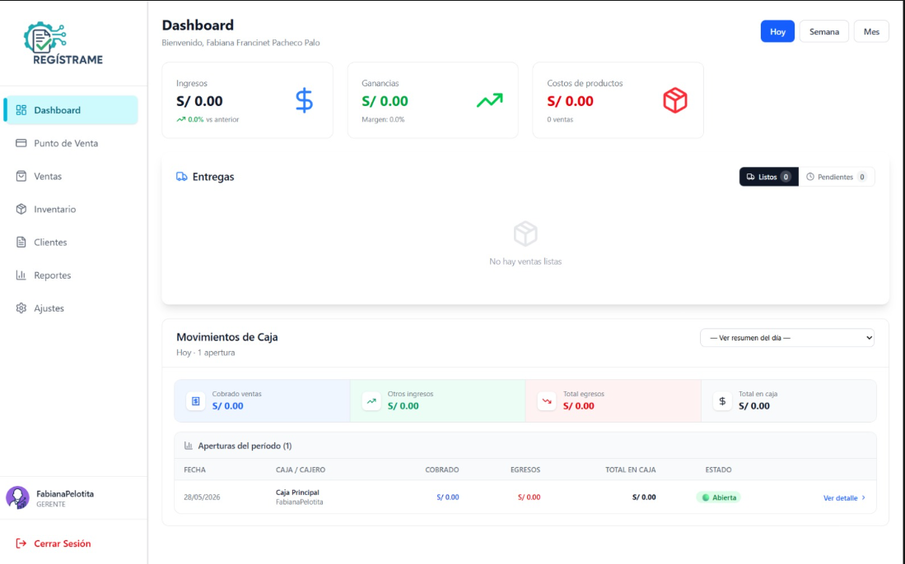
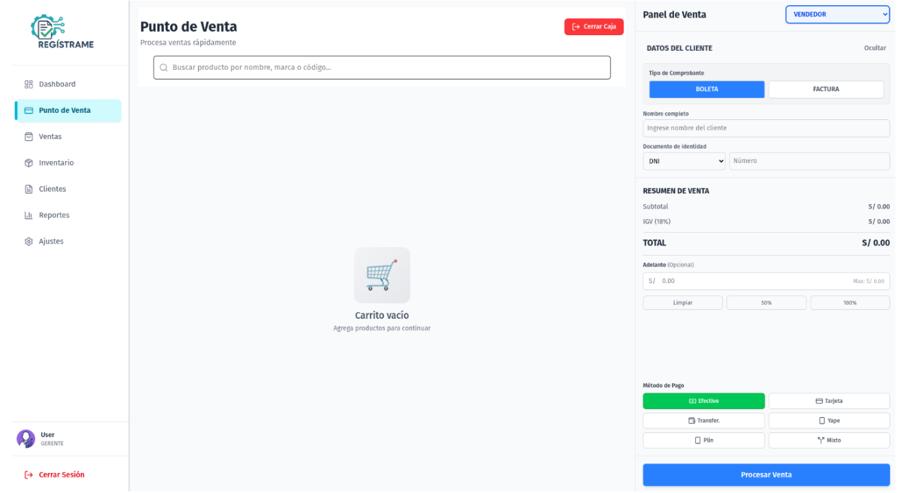
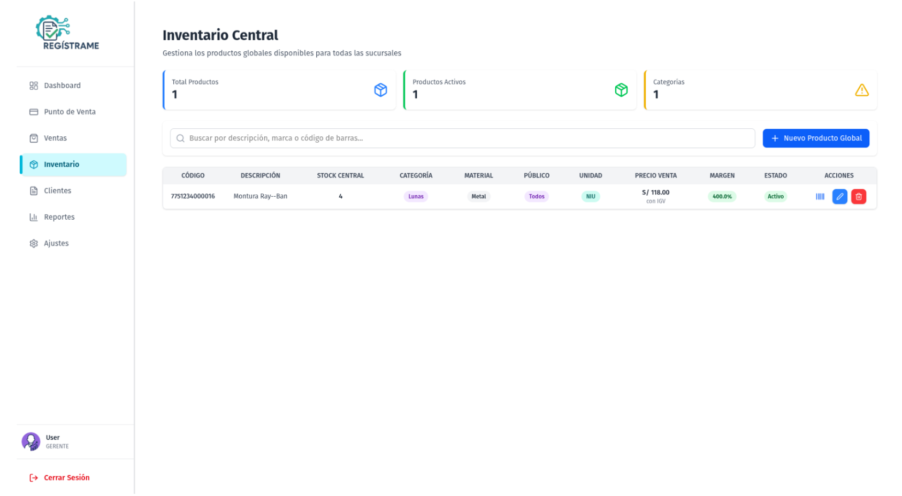

# RegistraMe

Sistema de gestión para óptica con arquitectura **backend + frontend + desktop**:

- `backend/`: API REST en Django
- `frontend/`: interfaz React + Vite + Tailwind
- `frontend/src-tauri/`: empaquetado desktop con Tauri (Windows)


## Vistas clave





## Stack

- Backend: Python, Django, Django REST Framework, JWT, PostgreSQL
- Frontend: React 19, TypeScript, Vite, TailwindCSS
- Desktop: Tauri 2 (Rust), backend Django embebido, PostgreSQL embebido

## Estructura del repositorio

```text
.
├─ backend/
│  ├─ registrame/          # settings y urls del proyecto Django
│  ├─ users/               # auth, usuarios, roles
│  ├─ products/            # productos y configuración de lunas
│  ├─ sales/               # ventas e impresión
│  ├─ cash/                # cajas y aperturas/cierres
│  ├─ clients/             # clientes y recetas
│  ├─ categories/          # categorías
│  ├─ suppliers/           # proveedores
│  ├─ opticalCenter/       # configuración de óptica
│  ├─ external_services/   # proxys/integraciones
│  └─ sequences/           # secuencias/correlativos
├─ frontend/
│  ├─ src/                 # aplicación React
│  └─ src-tauri/           # configuración y runtime Tauri
└─ docs/                   # documentación del proyecto
```

## Requisitos

- Python 3.11+
- Node.js 20+
- npm 10+
- PostgreSQL (para modo backend/frontend web)
- Rust toolchain (solo para Tauri)

## Entorno operativo

### Plataforma de hardware

- Memoria RAM: 4 GB como mínimo.
- Almacenamiento SSD de al menos 250 GB.
- Equipos periféricos como impresoras térmicas para la emisión de órdenes de venta.

### Sistemas operativos compatibles

- Windows.


## Variables y puertos

Valores usados en el código por defecto:

- API Django: `http://localhost:8000`
- Frontend Vite: `http://localhost:5173`
- PostgreSQL: `127.0.0.1:5433`
- Frontend usa `VITE_API_URL` (si no existe, usa `http://localhost:8000/api`)

Variables de base de datos (backend):

- `DB_ENGINE` (default: `django.db.backends.postgresql`)
- `DB_NAME` (default: `registrame_db`)
- `DB_USER` (default: `postgres`)
- `DB_PASSWORD` (default: vacío)
- `DB_HOST` (default: `127.0.0.1`)
- `DB_PORT` (default: `5433`)

## Levantar en modo web (backend + frontend)

### 1) Backend

```powershell
cd backend
python -m venv .venv
.\.venv\Scripts\Activate.ps1
pip install -r requirements.txt
python manage.py migrate
python manage.py runserver 127.0.0.1:8000
```

Opcional: crear superusuario

```powershell
python manage.py createsuperuser
```

### 2) Frontend

En otra terminal:

```powershell
cd frontend
npm install
npm run dev
```

## Levantar app desktop (Tauri)

La app Tauri está preparada para iniciar PostgreSQL y Django automáticamente usando binarios en `frontend/src-tauri/binaries/`.

```powershell
cd frontend
npm install
npm run tauri dev
```

Notas:

- En desarrollo, Tauri usa `npm run dev` para el frontend (`tauri.conf.json`).
- En primera ejecución puede tardar más por inicialización/migraciones.
- El backend embebido crea admin por defecto: `admin@registrame.com` / `admin123` (según `backend/run_server.py`).

## API (resumen)

Prefijo base: `/api/`

- `categories/`
- `products/`
- `clients/`
- `user/`
- `sales/`
- `suppliers/`
- `cash/`
- `proxy/`
- `opticalcenter/`
- `lunas/`

Autenticación JWT:

- `POST /api/user/token/`
- `POST /api/user/token/refresh/`

## Scripts útiles

Frontend (`frontend/package.json`):

- `npm run dev`
- `npm run build`
- `npm run build:check`
- `npm run lint`
- `npm run preview`
- `npm run tauri`

