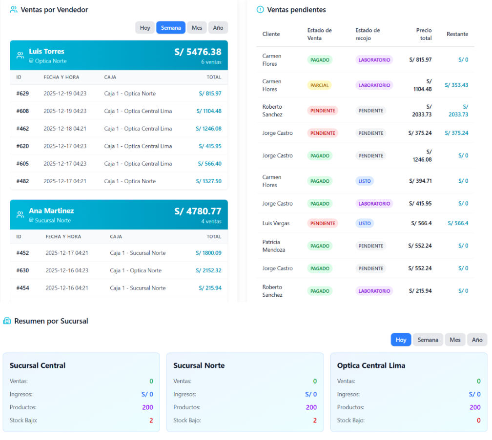

  
  <h1 style="color: #0F172A; font-size: 2.5rem; margin: 15px 0 5px 0; font-weight: 700; font-family: -apple-system, BlinkMacSystemFont, 'Segoe UI', Roboto, Helvetica, Arial, sans-serif;">Proyecto RegistreMe</h1>
  
QA Engineering Team: La Machaca

  
  

    
    
    
    
  

  <h3 style="color: #1E293B; margin-top: 0; font-size: 1.3rem; border-bottom: 1px solid #E2E8F0; padding-bottom: 8px; font-weight: 600;">Información Institucional</h3>
  <table style="width: 100%; border-collapse: collapse; margin-top: 10px;">
    <tr>
      <td style="padding: 6px 0; color: #64748B; width: 25%; font-weight: 500;">Universidad:</td>
      <td style="padding: 6px 0; color: #334155;">Universidad Nacional de San Agustín (UNSA)</td>
    </tr>
    <tr>
      <td style="padding: 6px 0; color: #64748B; font-weight: 500;">Escuela:</td>
      <td style="padding: 6px 0; color: #334155;">Profesional de Ingeniería de Sistemas</td>
    </tr>
    <tr>
      <td style="padding: 6px 0; color: #64748B; font-weight: 500;">Curso:</td>
      <td style="padding: 6px 0; color: #334155;">Pruebas de Software</td>
    </tr>
    <tr>
      <td style="padding: 6px 0; color: #64748B; font-weight: 500;">Docente:</td>
      <td style="padding: 6px 0; color: #334155;">Mg. Robert E. Arisaca</td>
    </tr>
    <tr>
      <td style="padding: 6px 0; color: #64748B; font-weight: 500;">Sustentación:</td>
      <td style="padding: 6px 0; color: #334155;">Primer Hito — Sprint 1 (28/29 de Mayo de 2026)</td>
    </tr>
  </table>
  
  
Integrantes del Equipo:

  <ul style="color: #334155; margin: 0; padding-left: 20px; line-height: 1.6;">
    <li>Ajra Huacso, Jeans Anthony</li>
    <li>Garambel Marin, Fernando Miguel</li>
    <li>Hancco Mullisaca, Sergio Danilo</li>
    <li>Huacani Jara, Denise Andrea</li>
    <li>Luque Condori, Luis Guillermo</li>
    <li>Pacheco Palo, Fabiana Francinet</li>
    <li>Valdivia Segovia, Ryan Fabian</li>
  </ul>

## 1. Introducción

El presente plan de trabajo describe la organización, metodología, roles y lineamientos técnicos contemplados por el **Equipo La Machaca** para la ejecución de pruebas de software, aseguramiento de la calidad y automatización aplicados al sistema de gestión de óptica **RegistreMe**, desarrollado íntegramente por el propio equipo.

El propósito fundamental de este proyecto es establecer una estrategia de QA orientada a prácticas ágiles, garantizando la trazabilidad desde los requerimientos iniciales hasta la automatización de la evidencia. El flujo completo se apoya en el ecosistema avanzado de GitHub: *GitHub Projects* para la gestión ágil, *GitHub Issues* para el backlog de historias de usuario, *GitHub Actions* para la ejecución continua de pipelines de testing, y *GitHub Pages* para la centralización de la documentación y presentación formal del producto.

---

## 2. Definición del Proyecto

### 2.1. Descripción del Producto de Software Seleccionado

**RegistreMe** es un sistema de escritorio para la **gestión integral de ópticas y tiendas de lentes**, desarrollado con una arquitectura moderna cliente-servidor. La aplicación permite administrar el ciclo completo de una óptica: desde el inventario de monturas y lunas hasta el punto de venta con comprobantes, gestión de clientes, control de caja y reportes por sucursal.

El sistema está orientado a negocios del sector óptico que requieren control de inventario especializado (monturas por material, talla y marca; lunas personalizadas por tipo y características como Blue Block o fotocromático), así como trazabilidad completa de ventas con estados de pago y de entrega de pedidos.

#### Características Principales del Sistema

* **Dashboard Gerencial en Tiempo Real:** Panel centralizado con métricas de ventas, ganancias, egresos y productos activos, con vistas por día, semana, mes y año. Soporte multisurcusal.
* **Punto de Venta Ágil:** Interfaz de venta rápida con búsqueda de productos, selección de cliente, múltiples métodos de pago (Efectivo, Yape, Visa, Transferencia, Plin, Mixto), gestión de adelantos y generación automática de comprobantes.
* **Gestión de Inventario Especializado:** Control de monturas (por marca, material, talla, color, forma y género) y lunas personalizadas (por material, tipo y características adicionales), con generación automática de códigos y descripciones.
* **Control de Caja y Sucursales:** Apertura y cierre de caja por sesión, con asignación automática al vendedor activo y soporte para múltiples sucursales.
* **Administración y Roles:** Gestión de usuarios con roles diferenciados (Gerente, Vendedor, Cajero, Supervisor, Optómetra, Logística), configuración de sucursales, proveedores y laboratorios.

#### Galería de Componentes del Producto

  
A. Dashboard Gerencial Principal

  
Panel de control en tiempo real con KPIs de ventas, ganancias, egresos y productos activos. Incluye ranking de clientes más frecuentes y gráfico de ventas totales por período.

  

    
  

  
B. Dashboard Secundario — Ventas por Vendedor y Sucursal

  
Vista detallada de ventas por vendedor con historial de transacciones, seguimiento de ventas pendientes con estados de pago y de recojo (Pendiente, Parcial, Pagado, Laboratorio, Listo), y resumen de desempeño por sucursal.

  

    
  

  
C. Punto de Venta

  
Interfaz de venta rápida con búsqueda de productos, registro de datos del cliente, selección de tipo de comprobante (Boleta/Factura), múltiples métodos de pago, gestión de adelantos y procesamiento de la venta con generación automática de nota de venta.

  

    
  

  
D. Inventario Central

  
Módulo de gestión de productos globales disponibles para todas las sucursales. Muestra código, descripción, stock central, categoría, material, público objetivo, precio de venta, margen de ganancia y estado. Permite agregar nuevos productos con generación automática de código y descripción.

  

    
  

  
E. Configuración y Administración de Acceso

  
Panel de administración con gestión de usuarios y permisos por rol, configuración de sucursales, cajas registradoras y proveedores. Permite agregar usuarios con roles como Gerente, Supervisor, Cajero, Vendedor y Optómetra.

  

    
  

### 2.2. Stack Tecnológico

<table style="width: 100%; border-collapse: collapse; border: 1px solid #E2E8F0; box-shadow: 0 4px 6px -1px rgba(0,0,0,0.02); margin-bottom: 30px;">
  <thead>
    <tr style="background-color: #F1F5F9; border-bottom: 2px solid #E2E8F0;">
      <th style="padding: 12px; text-align: left; color: #1E293B; font-weight: 600; width: 30%;">Capa</th>
      <th style="padding: 12px; text-align: left; color: #1E293B; font-weight: 600; width: 70%;">Tecnologías</th>
    </tr>
  </thead>
  <tbody style="color: #334155; line-height: 1.5;">
    <tr style="border-bottom: 1px solid #E2E8F0;">
      <td style="padding: 12px; font-weight: 600; color: #0284C7;">Backend</td>
      <td style="padding: 12px;">Python 3.12+, Django REST Framework, SQLite / PostgreSQL</td>
    </tr>
    <tr style="border-bottom: 1px solid #E2E8F0; background-color: #F8FAFC;">
      <td style="padding: 12px; font-weight: 600; color: #0284C7;">Frontend</td>
      <td style="padding: 12px;">React, TypeScript, Vite</td>
    </tr>
    <tr style="border-bottom: 1px solid #E2E8F0;">
      <td style="padding: 12px; font-weight: 600; color: #0284C7;">Empaquetado Desktop</td>
      <td style="padding: 12px;">Tauri (app nativa multiplataforma)</td>
    </tr>
    <tr style="border-bottom: 1px solid #E2E8F0; background-color: #F8FAFC;">
      <td style="padding: 12px; font-weight: 600; color: #0284C7;">CI/CD y QA</td>
      <td style="padding: 12px;">GitHub Actions, pytest, coverage.py, mypy</td>
    </tr>
  </tbody>
</table>

### 2.3. Justificación de la Elección

La elección de **RegistreMe** se fundamenta en su idoneidad para el trabajo de QA del curso:

* **Dominio real y representativo:** Sistema orientado al sector empresarial de ópticas, con lógica de negocio compleja y validaciones críticas en modelos.
* **Arquitectura modular:** Backend Django separado en apps independientes (`products`, `sales`, `clients`, `cash`, `users`, `suppliers`, `opticalCenter`) que facilita la cobertura por capas.
* **Código propio:** Al ser un proyecto desarrollado por el equipo, se tiene acceso total al código fuente, lo que permite diseñar pruebas tanto de caja blanca como de caja negra con mayor profundidad.
* **Reglas de negocio verificables:** Validaciones en modelos (stock, precios, lunas personalizadas, estados de venta) y flujos completos que pueden probarse con precisión mediante pruebas unitarias y de integración.

---

## 3. Objetivos del Proyecto

* **Objetivo General:** Diseñar, implementar y automatizar una estrategia de aseguramiento de calidad ágil para RegistreMe, incorporando pipelines de integración continua, trazabilidad absoluta de defectos y una cobertura final demostrable del **85%**.
* **Objetivos Específicos:**
  * Configurar un entorno de desarrollo local (DEV) homogéneo y reproducible para todos los miembros del equipo.
  * Definir formalmente el flujo de ramas de Git para la transición de código segura entre los entornos de `DEV` y `QA`.
  * Modelar las historias de usuario y criterios de aceptación mediante plantillas estructuradas en GitHub Issues.
  * Diseñar e implementar flujos automáticos en GitHub Actions para ejecutar pruebas de software ante cada Pull Request hacia la rama de calidad.
  * Incrementar y auditar la cobertura de código (Coverage) hasta asegurar un mínimo del 85% de efectividad en los módulos core del backend.
  * Documentar de manera transparente las evidencias, métricas y reportes de defectos mediante GitHub Pages y GitHub Wiki.

---

## 4. Metodología de Trabajo

Se utiliza un enfoque ágil basado en **Scrum**. El trabajo se divide en iteraciones cortas denominadas Sprints, asegurando entregables funcionales y revisiones constantes del backlog de QA.

### Herramientas del Ecosistema de Gestión

* **Git:** Control de versiones y gestión de ramas fijas (`main`, `qa`, `dev`).
* **GitHub Projects:** Tablero Kanban/Scrum para el seguimiento de tareas (Backlog, Ready, In Progress, In Review, Done).
* **GitHub Issues:** Gestión de historias de usuario, tareas técnicas y reporte de bugs con etiquetas estandarizadas.
* **GitHub Actions:** Automatización de la ejecución de `pytest` y generación de reportes de cobertura.
* **GitHub Pages:** Publicación del Plan de Trabajo institucional y presentación oficial del producto seleccionado.
* **GitHub Wiki:** Documentación técnica interna, manuales de instalación (DEV) y Plan de Pruebas detallado.

---

## 5. Roles y Responsabilidades

<table style="width: 100%; border-collapse: collapse; border: 1px solid #E2E8F0; box-shadow: 0 4px 6px -1px rgba(0,0,0,0.02); margin-bottom: 30px;">
  <thead>
    <tr style="background-color: #F1F5F9; border-bottom: 2px solid #E2E8F0;">
      <th style="padding: 12px; text-align: left; color: #1E293B; font-weight: 600; width: 25%;">Rol QA</th>
      <th style="padding: 12px; text-align: left; color: #1E293B; font-weight: 600; width: 45%;">Responsabilidades Clave</th>
      <th style="padding: 12px; text-align: left; color: #1E293B; font-weight: 600; width: 30%;">Integrantes Asignados</th>
    </tr>
  </thead>
  <tbody style="color: #334155; line-height: 1.5;">
    <tr style="border-bottom: 1px solid #E2E8F0;">
      <td style="padding: 12px; font-weight: 600; color: #0284C7;">Test Lead</td>
      <td style="padding: 12px;">Planificación estratégica, gestión de riesgos, control de Sprints y aprobación de entregables.</td>
      <td style="padding: 12px;">• Valdivia Segovia, Ryan Fabian • Ajra Huacso, Jeans Anthony</td>
    </tr>
    <tr style="border-bottom: 1px solid #E2E8F0; background-color: #F8FAFC;">
      <td style="padding: 12px; font-weight: 600; color: #0284C7;">Test Analyst</td>
      <td style="padding: 12px;">Análisis de criterios de aceptación, diseño de historias de usuario y documentación de defectos.</td>
      <td style="padding: 12px;">• Luque Condori, Luis Guillermo</td>
    </tr>
    <tr style="border-bottom: 1px solid #E2E8F0;">
      <td style="padding: 12px; font-weight: 600; color: #0284C7;">Test Architect</td>
      <td style="padding: 12px;">Diseño del entorno de pruebas, configuración de pipelines CI/CD y estándares de automatización.</td>
      <td style="padding: 12px;">• Garambel Marin, Fernando Miguel • Hancco Mullisaca, Sergio Danilo</td>
    </tr>
    <tr style="border-bottom: 1px solid #E2E8F0; background-color: #F8FAFC;">
      <td style="padding: 12px; font-weight: 600; color: #0284C7;">Test Designer</td>
      <td style="padding: 12px;">Creación detallada de casos de prueba, generación de datos de prueba y scripts de testing.</td>
      <td style="padding: 12px;">• Huacani Jara, Denise Andrea • Pacheco Palo, Fabiana Francinet</td>
    </tr>
  </tbody>
</table>

---

## 6. Plan del Proyecto y Alcance

* **Alcance Funcional:** Las pruebas y el aseguramiento de calidad se concentrarán de forma estricta en los siguientes módulos del backend de RegistreMe:
  * Módulo `products`: validaciones de modelos de monturas y accesorios, generación automática de códigos y descripciones, lógica de lunas personalizadas.
  * Módulo `sales`: flujo completo de venta (creación, pago, anulación), cálculo de totales, estados de pago y de pedido, generación de comprobantes.
  * Módulo `clients`: gestión de clientes con validaciones de documento de identidad.
  * Módulo `users`: autenticación, roles y control de acceso.
  * Módulo `cash`: apertura y cierre de caja, asignación de sesión a ventas.
* **Fuera de Alcance:**
  * Pruebas de la interfaz de usuario del frontend (React/Tauri).
  * Auditorías completas de seguridad perimetral o pruebas de penetración avanzada.
  * Pruebas de carga masiva o rendimiento a gran escala.

---

## 7. Cronograma de Sprints y Entregables

<table style="width: 100%; border-collapse: collapse; border: 1px solid #E2E8F0; box-shadow: 0 4px 6px -1px rgba(0,0,0,0.02); margin-bottom: 30px;">
  <thead>
    <tr style="background-color: #F1F5F9; border-bottom: 2px solid #E2E8F0;">
      <th style="padding: 12px; text-align: left; color: #1E293B; font-weight: 600; width: 15%;">Sprint</th>
      <th style="padding: 12px; text-align: left; color: #1E293B; font-weight: 600; width: 20%;">Fechas</th>
      <th style="padding: 12px; text-align: left; color: #1E293B; font-weight: 600; width: 35%;">Actividades Principales de QA</th>
      <th style="padding: 12px; text-align: left; color: #1E293B; font-weight: 600; width: 30%;">Entregables Clave</th>
    </tr>
  </thead>
  <tbody style="color: #334155; line-height: 1.5;">
    <tr style="border-bottom: 1px solid #E2E8F0;">
      <td style="padding: 12px; font-weight: 600;">Sprint 0</td>
      <td style="padding: 12px; color: #64748B;">28/05 - 03/06</td>
      <td style="padding: 12px;">Análisis inicial del repositorio RegistreMe, identificación de riesgos y configuración de entornos (Pages/Actions).</td>
      <td style="padding: 12px;">Repositorio base, GitHub Pages activo y setup de entorno DEV.</td>
    </tr>
    <tr style="border-bottom: 1px solid #E2E8F0; background-color: #F8FAFC;">
      <td style="padding: 12px; font-weight: 600;">Sprint 1</td>
      <td style="padding: 12px; color: #64748B;">04/06 - 17/06</td>
      <td style="padding: 12px;">Definición de la estrategia detallada de testing y diseño de casos de prueba base para los módulos <code>products</code>, <code>clients</code> y <code>users</code>.</td>
      <td style="padding: 12px;">Backlog en GitHub Issues y matriz de casos base priorizados.</td>
    </tr>
    <tr style="border-bottom: 1px solid #E2E8F0;">
      <td style="padding: 12px; font-weight: 600;">Sprint 2</td>
      <td style="padding: 12px; color: #64748B;">18/06 - 01/07</td>
      <td style="padding: 12px;">Diseño de escenarios de prueba para los módulos <code>sales</code> y <code>cash</code>, e inicio de la ejecución de pruebas unitarias.</td>
      <td style="padding: 12px;">Casos de prueba de ventas y caja, suite unitaria actualizada.</td>
    </tr>
    <tr style="border-bottom: 1px solid #E2E8F0; background-color: #F8FAFC;">
      <td style="padding: 12px; font-weight: 600;">Sprint 3</td>
      <td style="padding: 12px; color: #64748B;">02/07 - 15/07</td>
      <td style="padding: 12px;">Implementación y ejecución de pruebas de integración entre módulos. Pruebas de flujos end-to-end (venta completa → pago → comprobante) y análisis de fallos.</td>
      <td style="padding: 12px;">Suite de integración estable y reporte de defectos inicial.</td>
    </tr>
    <tr style="border-bottom: 1px solid #E2E8F0;">
      <td style="padding: 12px; font-weight: 600;">Sprint 4</td>
      <td style="padding: 12px; color: #64748B;">16/07 - 29/07</td>
      <td style="padding: 12px;">Auditoría de cobertura de código (Coverage >= 85%), análisis de tipado estricto con mypy y pruebas de regresión completa en CI.</td>
      <td style="padding: 12px;">Reporte de cobertura final, pipeline verde y hardening del código.</td>
    </tr>
    <tr style="border-bottom: 1px solid #E2E8F0; background-color: #F8FAFC;">
      <td style="padding: 12px; font-weight: 600;">Sprint 5</td>
      <td style="padding: 12px; color: #64748B;">30/07 - 05/08</td>
      <td style="padding: 12px;">Fase de cierre de testing: preparación de métricas finales, lecciones aprendidas y empaquetado de evidencias para la entrega final.</td>
      <td style="padding: 12px;">Informe final de cierre de QA y matriz de defectos cerrada.</td>
    </tr>
  </tbody>
</table>

---

## 8. Estructura de Entornos y Flujo de Trabajo

### Flujo de Integración Continua (DEV ➔ QA ➔ MAIN)

Para garantizar la estabilidad del software, el equipo implementará un flujo de promoción de código estrictamente controlado por automatizaciones:

1. **Entorno DEV (Ramas de características):** Cada diseñador o arquitecto de pruebas escribe sus scripts localmente en ramas aisladas de tipo `feature/nombre-de-la-tarea`.
2. **Entorno QA (Rama `qa`):** Al solicitar la integración mediante un Pull Request hacia la rama `qa`, *GitHub Actions* se dispara automáticamente ejecutando la suite completa de pruebas. Si el porcentaje de cobertura disminuye por debajo del 85% o una prueba unitaria falla, la integración se bloquea de manera obligatoria para resguardar la calidad.
3. **Entorno Estable (Rama `main`):** Una vez validadas todas las pruebas y métricas en el entorno de calidad, el Test Lead autoriza el paso final (merge) del código hacia la rama principal estable.

---

  Información Técnica Adicional: El detalle del Plan de Pruebas, la guía de instalación y la configuración técnica del entorno de desarrollo se encuentran centralizados en nuestra <a href="https://github.com/RyanValdivia/ps-machacas/wiki" style="color: #0284C7; font-weight: bold; text-decoration: underline;">Wiki Oficial del Proyecto</a>.

---
