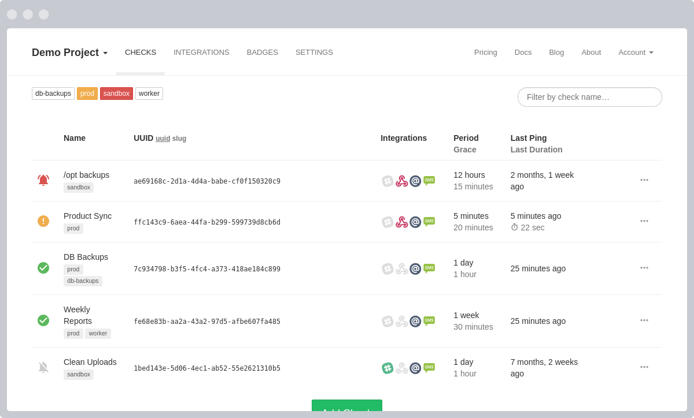
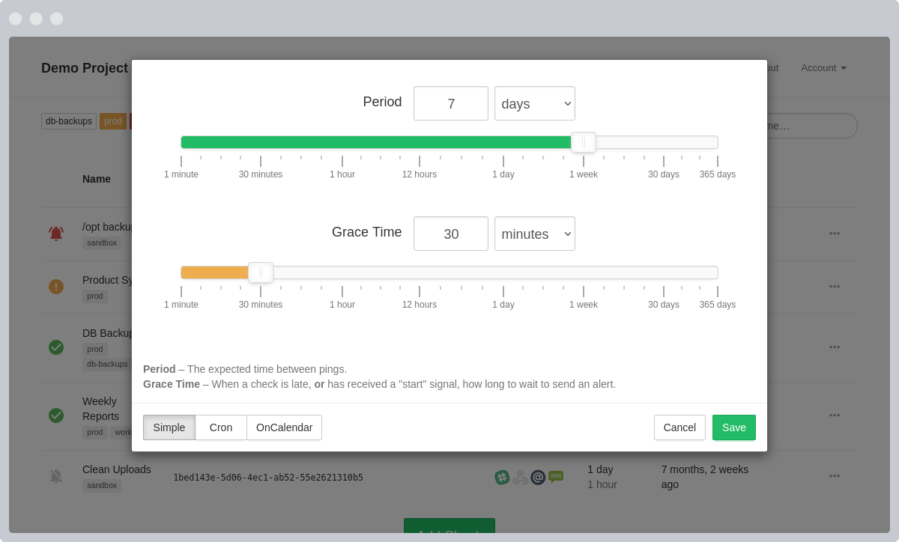
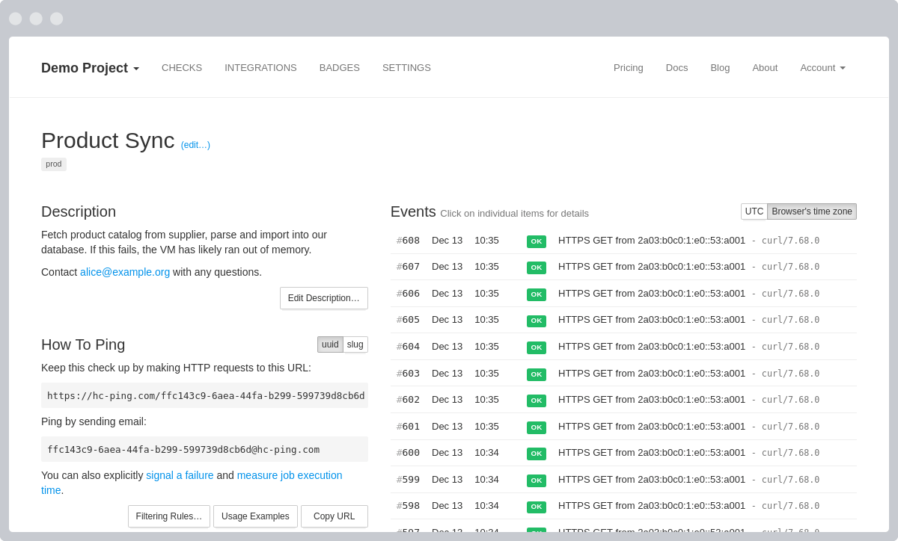

  
  <h1> Proyecto Healthchecks   <small>QA Team: La Machaca</small></h1>

  
  
  

 

---

## Información Institucional

* **Universidad:** Universidad Nacional de San Agustín (UNSA)
* **Escuela:** Profesional de Ingeniería de Sistemas
* **Curso:** Pruebas de Software
* **Docente:** Mg. Robert E. Arisaca
* **Ubicación:** Arequipa, Perú
* **Fecha de Sustentación:** Hito 1 (28/29 de Mayo de 2026)
* **Integrantes del Equipo:**
  * Ajra Huacso, Jeans Anthony
  * Garambel Marin, Fernando Miguel
  * Hancco Mullisaca, Sergio Danilo
  * Huacani Jara, Denise Andrea
  * Luque Condori, Luis Guillermo
  * Pacheco Palo, Fabiana Francinet
  * Valdivia Segovia, Ryan Fabian

---

## 1. Introducción

El presente plan de trabajo describe la organización, metodología, roles y lineamientos técnicos contemplados por el **Equipo La Machaca** para la ejecución de pruebas de software, aseguramiento de la calidad y automatización aplicados al repositorio oficial de **Healthchecks** (<https://github.com/healthchecks/healthchecks>).

El propósito fundamental de este proyecto es establecer una estrategia de QA orientada a prácticas ágiles, garantizando la trazabilidad desde los requerimientos iniciales hasta la automatización de la evidencia. El flujo completo se apoya en el ecosistema avanzado de GitHub: *GitHub Projects* para la gestión ágil, *GitHub Issues* para el backlog de historias de usuario, *GitHub Actions* para la ejecución continua de pipelines de testing, y *GitHub Pages* para la centralización de la documentación técnica de cara a la presentación del producto.

La estrategia prioriza la construcción y réplica estructurada de pruebas unitarias e integración siguiendo el principio de detección temprana de defectos, asegurando que cada incremento sea auditable y cumpla con los exigentes estándares solicitados.

---

## 2. Definición del Proyecto

### 2.1. Descripción del Producto de Software Seleccionado

El software seleccionado es **Healthchecks**, un servicio interactivo y funcional de monitoreo diseñado para supervisar tareas programadas en segundo plano (*cron jobs*) e infraestructuras críticas. Funciona mediante un mecanismo de alertas activas: escucha peticiones HTTP y mensajes de correo electrónico ("pings") provenientes de las tareas programadas; si un "ping" no llega a tiempo dentro del margen configurado, el sistema asume un fallo silencioso y despacha notificaciones automáticas.

#### Características Principales del Sistema

* **Dashboard Web Interactivo:** Panel centralizado que actualiza en tiempo real el estado operativo de cada chequeo de infraestructura.
* **Arquitectura API-First:** Posee una API REST robusta para gestionar, crear y supervisar alertas de forma programática.
* **Más de 25 Integraciones:** Capacidad nativa para despachar alertas mediante canales corporativos como Slack, Discord, Telegram, Microsoft Teams, Webhooks, correos electrónicos y SMS.
* **Seguridad y Gestión:** Soporte para autenticación de dos factores (2FA) mediante WebAuthn, inicio de sesión externo por encabezados HTTP y gestión avanzada de proyectos por equipos con accesos de solo lectura.

#### Vista de Componentes y Funcionalidades del Producto

**1. Dashboard Principal ("My Checks")**
Muestra de forma gráfica y en vivo el estado de salud de todos los procesos de automatización o respaldos del negocio. Es el componente clave para evaluar la persistencia de datos.

  
   
  <em>Figura 1: Panel de control interactivo con actualizaciones en tiempo real.</em>

 

**2. Formulario de Configuración de Tiempos (Period & Grace Time)**
Lógica que determina las tolerancias de tiempo de los procesos del cliente. Representa un módulo crítico para el diseño de casos de prueba funcionales y pruebas de límites.

  
   
  <em>Figura 2: Interfaz de asignación de periodos esperados y tiempos de gracia.</em>

 

**3. Historial Detallado y Log de Eventos**
Registro cronológico de cada petición recibida por el backend, indispensable para auditar las pruebas de integración en el entorno de calidad.

  
   
  <em>Figura 3: Traza y bitácora de pings entrantes con marcas de tiempo detalladas.</em>

---

### 2.2. Alternativas Evaluadas

Antes de seleccionar el software definitivo, el equipo analizó minuciosamente tres alternativas técnicas bajo los mismos criterios de aceptación:

1. **Django-Ledger (Empresarial):** Sistema de contabilidad financiera de doble entrada. Aunque poseía una robusta lógica de negocio empresarial, se descartó debido a que su volumen de código excedía el rango límite permitido por la rúbrica y presentaba inestabilidades técnicas complejas para la cobertura ágil en el tiempo del curso.
2. **HealthDB (Salud):** Sistema para la gestión de registros médicos. Fue descartado debido a que la gran mayoría de su base de código estaba desarrollada en componentes de interfaz gráfica (JavaScript/CSS), reduciendo el código Python a un porcentaje mínimo que no cumplía con el núcleo del stack solicitado.
3. **AcademicsToday Django (Educación):** Plataforma para cursos en línea. Se desestimó debido a que su enfoque principal no correspondía estrictamente a los sectores prioritarios requeridos (Empresarial o Salud) y presentaba una arquitectura desactualizada en sus dependencias de desarrollo.

### 2.3. Justificación de la Elección Final

La elección de **Healthchecks** se fundamenta en su total cumplimiento con los criterios de aceptación del curso:

* **Stack y Licencia:** Construido puramente en Python (3.12+) y Django (6.0), empleando bases de datos relacionales libres, bajo una licencia de software permisiva compatible con los entornos académicos requeridos.
* **Tamaño Controlado:** Su núcleo de código de backend se mantiene estrictamente dentro del rango de 10,000 a 30,000 líneas de código útil, permitiendo un análisis profundo sin riesgo de inmanejabilidad.
* **Idoneidad para QA:** El proyecto ya cuenta con una suite nativa de pruebas estructuradas y una insignia de cobertura verificable. Esto permite al equipo estudiar los estándares de ingeniería preexistentes, replicar los flujos y diseñar de manera óptima las nuevas suites unitarias y de integración necesarias para el cumplimiento del 85% solicitado.

---

## 3. Objetivos del Proyecto

### Objetivo General

Diseñar, implementar y automatizar una estrategia de aseguramiento de calidad ágil para la plataforma Healthchecks, incorporando pipelines de integración continua, trazabilidad absoluta de defectos y una cobertura final demostrable del 85%.

### Objetivos Específicos

* Configurar un entorno de desarrollo local (DEV) homogéneo y reproducible para todos los miembros del equipo.
* Definir formalmente el flujo de ramas de Git para la transición de código segura entre los entornos de `DEV` y `QA`.
* Modelar las historias de usuario y criterios de aceptación mediante plantillas estructuradas en GitHub Issues.
* Diseñar e implementar flujos automáticos en GitHub Actions para ejecutar pruebas de software ante cada Pull Request hacia la rama de calidad.
* Incrementar y auditar la cobertura de código (Coverage) hasta asegurar un mínimo del 85% de efectividad en los módulos core.
* Documentar de manera transparente las evidencias, métricas y reportes de defectos mediante GitHub Pages y GitHub Wiki.

---

## 4. Metodología de Trabajo

Se utiliza un enfoque ágil basado en **Scrum**. El trabajo se divide en iteraciones cortas denominadas Sprints, asegurando entregables funcionales y revisiones constantes del backlog de QA.

### Herramientas de Gestión

| Herramienta | Uso Específico en el Proyecto |
| :--- | :--- |
| **Git** | Control de versiones y gestión de ramas fijas (`main`, `qa`, `dev`). |
| **GitHub Projects** | Tablero Kanban/Scrum (Backlog, Ready, In Progress, In Review, Done). |
| **GitHub Issues** | Gestión de historias de usuario, tareas técnicas y reporte de bugs con etiquetas. |
| **GitHub Actions** | Automatización de la ejecución de `pytest` y generación de reportes de cobertura. |
| **GitHub Pages** | Publicación del Plan de Trabajo institucional y presentación oficial del producto seleccionado. |
| **GitHub Wiki** | Documentación técnica interna, manual de instalación (DEV) y Plan de Pruebas Unitarias detallado. |

---

## 5. Roles y Responsabilidades

El equipo se ha organizado distribuyendo las responsabilidades técnicas del ciclo de vida de pruebas de la siguiente manera:

| Rol QA | Responsabilidades Clave | Integrantes Asignados |
| :--- | :--- | :--- |
| **Test Lead** | Planificación estratégica, gestión de riesgos, control de Sprints y aprobación de entregables. | *Valdivia Segovia, Ryan Fabian * Ajra Huacso, Jeans Anthony |
| **Test Analyst** | Análisis de criterios de aceptación, diseño de historias de usuario y documentación de defectos. | * Luque Condori, Luis Guillermo |
| **Test Architect** | Diseño del entorno de pruebas, configuración de pipelines CI/CD y estándares de automatización. | *Garambel Marin, Fernando Miguel * Hancco Mullisaca, Sergio Danilo |
| **Test Designer** | Creación detallada de casos de prueba, generación de datos de prueba y scripts de testing. | *Huacani Jara, Denise Andrea * Pacheco Palo, Fabiana Francinet |

---

## 6. Plan del Proyecto y Alcance

### Alcance Funcional

Las pruebas y el aseguramiento de calidad se concentrarán de forma estricta en los siguientes componentes del núcleo de Healthchecks:

* Sistema de autenticación de usuarios, perfiles y tokens de administración.
* Motor de procesamiento de peticiones (Pings) y verificación de tiempos de respuesta en segundo plano.
* Módulos de integración de canales de alertas y notificaciones externas (Slack, Webhooks, etc.).
* API REST técnica para la gestión remota de chequeos de servidores.

### Fuera de Alcance

* Auditorías completas de seguridad perimetral o pruebas de penetración avanzada.
* Despliegue de servidores en entornos de producción comercial real.
* Pruebas de carga masiva o rendimiento a gran escala fuera de entornos simulados de testing.

---

## 7. Cronograma de Sprints y Entregables

| Sprint | Fechas | Actividades Principales de QA | Entregables Clave |
| :--- | :--- | :--- | :--- |
| **Sprint 0** | 28/05/2026 - 03/06/2026 | Análisis inicial del repositorio Healthchecks, identificación de riesgos y configuración de entornos (Pages/Actions). | Repositorio base, GitHub Pages activo y setup de entorno DEV. |
| **Sprint 1** | 04/06/2026 - 17/06/2026 | Definición de la estrategia detallada de testing y diseño de casos de prueba base para los módulos `accounts`, `api` y `lib`. | Backlog en GitHub Issues y matriz de casos base priorizados. |
| **Sprint 2** | 18/06/2026 - 01/07/2026 | Diseño de escenarios de prueba para la interfaz (`front`), integraciones externas y comienzo de la ejecución de pruebas unitarias. | Casos de prueba de UI e integraciones, suite unitaria actualizada. |
| **Sprint 3** | 02/07/2026 - 15/07/2026 | Implementación y ejecución de pruebas de integración. Pruebas de compatibilidad multi-base de datos (Postgres/MySQL) y análisis de fallos. | Suite de integración estable y reporte de defectos inicial. |
| **Sprint 4** | 16/07/2026 - 29/07/2026 | Auditoría de cobertura de código (Coverage $\ge$ 85%), análisis de tipado estricto con `mypy` y pruebas de regresión completa en CI. | Reporte de cobertura final, pipeline verde y hardening del código. |
| **Sprint 5** | 30/07/2026 - 05/08/2026 | Fase de cierre de testing: preparación de métricas finales, lecciones aprendidas y empaquetado de evidencias para la entrega final. | Informe final de cierre de QA y matriz de defectos cerrada. |

---

## 8. Estructura de Entornos y Flujo de Trabajo

### Flujo de Integración Continua (DEV ➔ QA ➔ MAIN)

Para garantizar la estabilidad del software, el equipo implementará un flujo de promoción de código estrictamente controlado por automatizaciones:

1. **Entorno DEV (Ramas de características):** Cada diseñador o arquitecto de pruebas escribe sus scripts localmente en ramas aisladas de tipo `feature/`.
2. **Entorno QA (Rama `qa`):** Al solicitar la integración mediante un Pull Request hacia la rama `qa`, *GitHub Actions* se dispara automáticamente ejecutando la suite completa de pruebas. Si el porcentaje de cobertura disminuye por debajo del 85% o una prueba unitaria falla, la integración se bloquea de manera obligatoria para resguardar la calidad.
3. **Entorno Estable (Rama `main`):** Una vez validadas todas las pruebas y métricas en el entorno de calidad, el Test Lead autoriza el paso final (merge) del código hacia la rama principal estable.

---

**Información Técnica Adicional:** El detalle del **Plan de Pruebas Unitarias**, la guía paso a paso de comandos de instalación de la base de datos y la configuración del entorno local de desarrollo se encuentran centralizados en nuestra [Wiki Oficial del Proyecto](https://github.com/RyanValdivia/ps-machacas/wiki)
---
